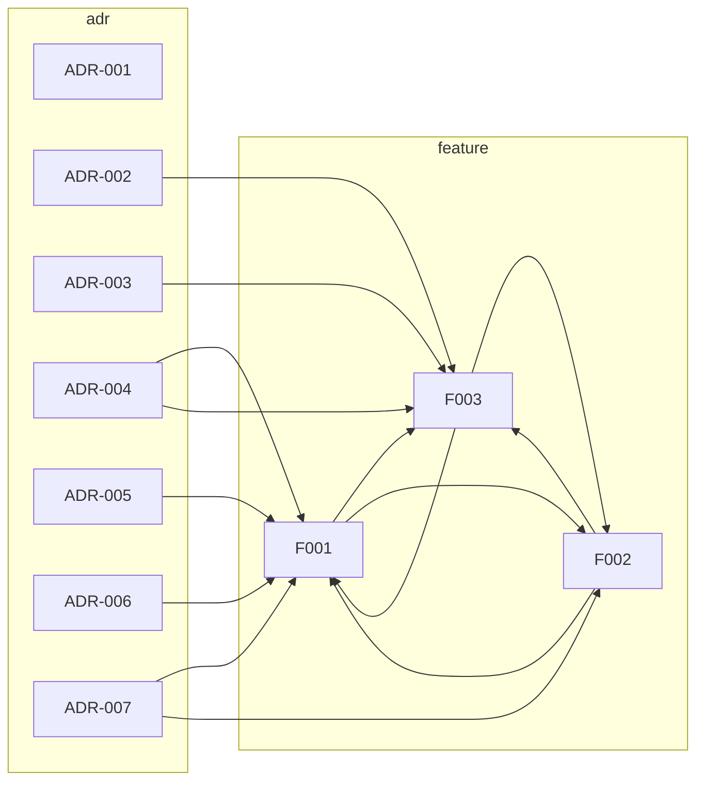

# Wiki 지식 그래프

```mermaid
graph LR
  subgraph feature["feature"]
    F001["F001"]
    F002["F002"]
    F003["F003"]
  end
  subgraph adr["adr"]
    ADR-001["ADR-001"]
    ADR-002["ADR-002"]
    ADR-003["ADR-003"]
    ADR-004["ADR-004"]
    ADR-005["ADR-005"]
    ADR-006["ADR-006"]
    ADR-007["ADR-007"]
  end
  F003 --> F001
  F003 --> F002
  F002 --> F001
  F002 --> F003
  F001 --> F003
  F001 --> F002
  ADR-002 --> F003
  ADR-006 --> F001
  ADR-007 --> F001
  ADR-007 --> F002
  ADR-003 --> F003
  ADR-005 --> F001
  ADR-004 --> F001
  ADR-004 --> F003
```
